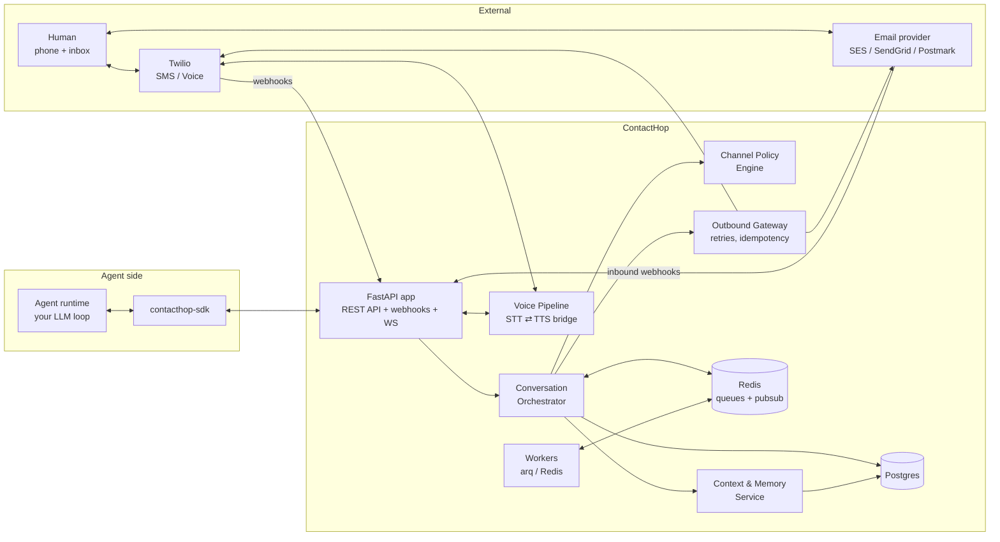
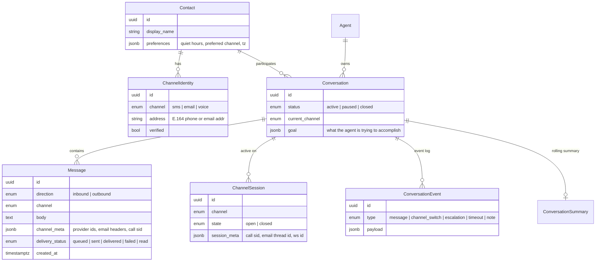

# ContactHop Architecture

ContactHop is an agentic communication harness: an orchestration layer that lets AI agents hold one continuous conversation with a human across SMS, email, and voice, hopping channels mid-conversation without losing context.

This document describes the target architecture for a Python / FastAPI implementation.

---

## 1. Design principles

1. **Channel-agnostic core.** A conversation is a single logical thread. SMS, email, and voice are delivery mechanisms, not conversation boundaries. All channel-specific concerns live at the edges in adapters.
2. **Agent-agnostic harness.** ContactHop does not *contain* the agent's brain. It exposes a clean interface (HTTP API + webhooks + Python SDK) that any agent runtime (Claude, LangGraph, a bespoke loop) plugs into. A reference agent ships in-tree, but is swappable.
3. **Async everywhere.** FastAPI + asyncio end to end. Channel I/O is slow and bursty; nothing blocks the event loop.
4. **Event-sourced messaging.** Every inbound/outbound message and channel transition is an immutable event. The conversation transcript is a projection over events, which makes cross-channel continuity, replay, and debugging tractable.
5. **Policy-driven channel selection.** The decision "which channel do I use right now?" is made by an explicit, testable policy engine — not scattered if-statements — with the agent able to override it.

---

## 2. System overview



**Request flow in one sentence:** provider webhooks land in FastAPI, get normalized into channel-agnostic `InboundMessage` events, the orchestrator attaches them to a conversation and notifies the agent; the agent replies through the API, the policy engine picks (or confirms) the delivery channel, and the outbound gateway sends via the right adapter.

---

## 3. Core domain model



Key modeling decisions:

- **`Contact` vs `ChannelIdentity`.** A human is one `Contact` with N addresses. Identity resolution (this phone number and this email are the same person) is what makes cross-channel continuity possible. Inbound messages from unknown addresses either match an existing identity, or create a provisional contact pending merge.
- **`Conversation` is channel-free.** It has a `current_channel` (where we'd reach the human right now) but its transcript interleaves messages from all channels in one timeline.
- **`ChannelSession` models stateful channels.** An email thread and an SMS exchange are cheap sessions; a live voice call is an expensive one with real-time state. Sessions let the orchestrator know "there is an open call right now — route agent output to the voice pipeline, not to SMS."
- **`ConversationEvent` is the source of truth** for anything that isn't a message: channel switches ("moving this to email, it's getting long"), escalations, no-response timeouts, agent annotations.

---

## 4. Package layout

```
contacthop/
├── pyproject.toml              # uv-managed; hatchling build
├── src/contacthop/
│   ├── main.py                 # FastAPI app factory, lifespan, DI wiring
│   ├── config.py               # pydantic-settings (env-driven)
│   ├── api/                    # HTTP surface
│   │   ├── routes/
│   │   │   ├── conversations.py
│   │   │   ├── contacts.py
│   │   │   ├── messages.py
│   │   │   └── agents.py
│   │   ├── webhooks/
│   │   │   ├── twilio_sms.py
│   │   │   ├── twilio_voice.py
│   │   │   └── email_inbound.py
│   │   ├── ws/
│   │   │   ├── voice_media.py  # Twilio Media Streams bridge
│   │   │   └── agent_stream.py # live event stream for agents
│   │   └── deps.py             # FastAPI dependencies (db session, auth)
│   ├── domain/                 # pure business objects, no I/O
│   │   ├── models.py           # SQLAlchemy 2.0 mapped classes
│   │   ├── schemas.py          # Pydantic v2 API/event schemas
│   │   └── events.py           # typed ConversationEvent payloads
│   ├── orchestrator/
│   │   ├── conversation.py     # attach inbound msgs, notify agent, lifecycle
│   │   ├── policy.py           # channel selection engine
│   │   └── escalation.py       # timeout / urgency rules
│   ├── channels/               # adapter layer — the only provider-aware code
│   │   ├── base.py             # ChannelAdapter protocol
│   │   ├── sms/twilio.py
│   │   ├── email/{ses,sendgrid,smtp}.py
│   │   └── voice/
│   │       ├── twilio_call.py  # call control (originate, TwiML)
│   │       └── pipeline.py     # STT ⇄ agent ⇄ TTS streaming loop
│   ├── memory/
│   │   ├── transcript.py       # unified cross-channel transcript projection
│   │   ├── summarizer.py       # rolling summaries for context windows
│   │   └── store.py            # durable memory / facts about the contact
│   ├── outbound/
│   │   ├── gateway.py          # send with idempotency keys, retry, DLQ
│   │   └── formatting.py       # one agent reply → SMS segments / email body / speech
│   ├── agents/
│   │   ├── protocol.py         # AgentConnector protocol (push vs poll)
│   │   └── reference.py        # reference agent (Claude API) — optional extra
│   ├── workers/
│   │   ├── arq_worker.py       # background jobs: sends, timeouts, summarization
│   │   └── jobs/
│   └── db/
│       ├── session.py          # async engine/session
│       └── migrations/         # alembic
├── sdk/                        # contacthop-sdk: thin async client for agent runtimes
└── tests/
```

---

## 5. Technology choices

| Concern | Choice | Why |
|---|---|---|
| Web framework | **FastAPI** | Async, Pydantic-native, WebSockets for voice media streams |
| Validation / schemas | **Pydantic v2** | Shared shapes between API, events, and queue payloads |
| ORM / DB | **SQLAlchemy 2.0 (async) + Alembic + Postgres** | JSONB for channel metadata, real transactions for event log |
| Queue / pubsub | **Redis + arq** | Lightweight async-native jobs (outbound sends, timeouts, summarization); Redis pub/sub fans events out to agent WebSocket streams |
| SMS + Voice | **Twilio** (adapter-abstracted) | Messaging API, Programmable Voice, Media Streams for real-time audio |
| Email | **SES / SendGrid / Postmark** behind one adapter | Inbound parse webhooks + threading headers (`In-Reply-To`) |
| Voice STT/TTS | **Deepgram / Whisper** and **ElevenLabs / OpenAI TTS** behind protocols | Streaming-capable; swappable |
| Packaging / tooling | **uv, ruff, mypy (strict), pytest + pytest-asyncio** | Modern Pythonic baseline |
| Deploy | Docker: `api` + `worker` containers, Postgres, Redis | Two processes, horizontal-scalable |

---

## 6. The interesting parts

### 6.1 Channel adapters

Every channel implements one protocol; the rest of the system never imports a provider SDK:

```python
class ChannelAdapter(Protocol):
    channel: ChannelType

    async def send(self, msg: OutboundMessage, identity: ChannelIdentity) -> ProviderReceipt: ...
    async def parse_inbound(self, request: Request) -> InboundMessage: ...
    async def verify_webhook(self, request: Request) -> bool: ...   # signature checks
```

Voice is the exception with an extended interface (`originate_call`, `open_media_session`) because it is session-based rather than message-based.

### 6.2 Channel policy engine

Channel selection is a pure, testable function over explicit signals:

```python
@dataclass
class ChannelDecision:
    channel: ChannelType
    reason: str                 # logged as a ConversationEvent
    fallback: ChannelType | None

async def decide(ctx: PolicyContext) -> ChannelDecision: ...
```

`PolicyContext` carries: message urgency (agent-declared), payload shape (long-form / attachments ⇒ email), contact preferences and quiet hours, per-channel responsiveness stats (median reply latency per channel for this contact), time of day, and whether a live session is already open. Policies are ordered rules with a default; the agent may pass `channel="email"` explicitly to override, and the override is recorded as an event.

Escalation is the time-driven half of the same engine: a no-reply timeout job (scheduled at send time) re-invokes the policy with `attempt=n`, producing ladders like *SMS → wait 2h → email → wait 1 day → voice call*.

> Implementation note: follow-ups are persisted `FollowUp` rows fired by an in-process poll loop (`orchestrator/scheduler.py`), which keeps single-process deployments dependency-free. The Redis/arq worker becomes the firing mechanism at horizontal scale without changing the data model.

### 6.3 Cross-channel continuity

- **One transcript.** `memory/transcript.py` projects all messages and channel-switch events into a single ordered timeline. When the agent needs context, it gets *the conversation*, never "the SMS thread."
- **Rolling summaries.** A background job maintains a `ConversationSummary` so long conversations fit an LLM context window: recent messages verbatim + summary of the rest.
- **Switch etiquette.** When the policy switches channels, the orchestrator prompts the agent to open with a bridge line ("Following up on our call this morning —") using the transcript, so hops feel natural to the human.
- **Email threading.** Outbound email sets `In-Reply-To`/`References` from stored `channel_meta`, so the human's mail client keeps one thread too.

### 6.4 Voice pipeline

Voice is real-time and needs its own loop:

```
Twilio call ⇄ Media Streams WS ⇄ /ws/voice/{session_id}
                                   │
                     STT (streaming partials)
                                   │
                agent turn (token-streamed reply)
                                   │
                     TTS (streamed audio frames back)
```

The pipeline handles barge-in (human speaks over TTS ⇒ cancel synthesis), endpointing (when is the human done talking), and writes the final transcript of each turn into the same `Message` table — so a phone call and a text message are indistinguishable to the memory layer.

### 6.5 Agent interface

Agents integrate one of three ways, all built on the same event schema:

1. **Webhook push (default):** ContactHop POSTs `conversation.message.received` (and lifecycle events) to the agent's URL; the agent replies via `POST /conversations/{id}/messages`.
2. **WebSocket stream:** `/ws/agents/{agent_id}` for low-latency runtimes (required for voice turns).
3. **Python SDK:** `contacthop-sdk` wraps both plus typed models:

```python
hop = ContactHop(api_key=...)

@hop.on_message
async def handle(conv: Conversation, msg: InboundMessage) -> None:
    reply = await my_llm(conv.transcript(), msg)
    await conv.send(reply)                       # policy engine picks channel
    # or: await conv.send(reply, channel="email", urgency="high")
```

### 6.6 Outbound gateway

All sends flow through one gateway that provides: idempotency keys (safe retries), provider retry with backoff + dead-letter queue, delivery-status webhook ingestion (updating `Message.delivery_status`), per-contact rate limiting, quiet-hours enforcement as a hard backstop below the policy engine, and channel formatting (one logical agent reply → 160-char SMS segmentation, or HTML+text email with subject generation, or SSML for voice).

---

## 7. API surface (v1)

```
POST   /v1/contacts                          create contact + identities
POST   /v1/conversations                     start a conversation (goal, contact, initial channel hint)
GET    /v1/conversations/{id}                state + current_channel + open sessions
GET    /v1/conversations/{id}/transcript     unified cross-channel transcript
POST   /v1/conversations/{id}/messages       agent sends a reply (optional channel/urgency override)
POST   /v1/conversations/{id}/switch         explicit channel switch (agent- or operator-initiated)
POST   /v1/conversations/{id}/call           originate a voice call now
GET    /v1/conversations/{id}/events         event log

POST   /webhooks/twilio/sms                  inbound SMS + delivery status
POST   /webhooks/twilio/voice                call lifecycle (TwiML callbacks)
POST   /webhooks/email/inbound               inbound email parse
WS     /ws/voice/{session_id}                Twilio media stream bridge
WS     /ws/agents/{agent_id}                 agent event stream
```

Auth: API keys per agent (hashed at rest) for the management API; provider signature verification on every webhook; short-lived tokens embedded in WS URLs.

---

## 8. Security & compliance notes

- Verify **every** provider webhook signature (Twilio `X-Twilio-Signature`, SendGrid/SES equivalents) before parsing.
- Message bodies are PII: encrypt at rest where feasible, redact from logs by default, retention policy per contact.
- Consent tracking on `ChannelIdentity` (SMS opt-in/opt-out incl. STOP keyword handling — legally required; call-recording consent per jurisdiction).
- Rate limits and quiet hours enforced in the gateway even if a buggy agent tries to spam.

---

## 9. Build order

1. **Phase 1 — Skeleton + SMS loop.** FastAPI app, Postgres models, Twilio SMS adapter in/out, conversation + transcript, webhook agent interface. *End-to-end: agent texts a human and gets replies.*
2. **Phase 2 — Email + policy engine.** Email adapter with threading, identity resolution, the policy engine + escalation timers. *First real channel hop: SMS → email.*
3. **Phase 3 — Voice.** Call origination, Media Streams pipeline, STT/TTS streaming, voice turns in the shared transcript. *Full tri-modal continuity.*
4. **Phase 4 — Harness maturity.** SDK polish, rolling summaries, responsiveness stats feeding the policy, delivery analytics, multi-agent tenancy.
